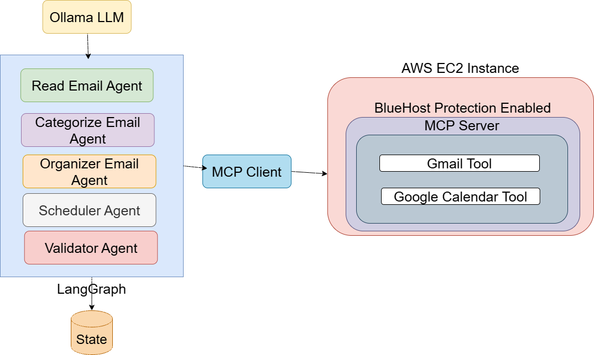

# \# 📥 GmailCategorizer

# \### AI-Powered Email Triage \& Scheduling Agent using MCP, LangGraph, SQLite Memory, and Ollama

# 

# GmailCategorizer is an intelligent email-triage agent that automatically:

# 

# ✔ Fetches unread Gmail messages via \*\*MCP Gmail server\*\*  

# ✔ Stores emails in \*\*SQLite memory\*\*  

# ✔ Categorizes each email using \*\*Ollama (Qwen2.5-0.5B)\*\*  

# ✔ Applies smart label rules (urgent / newsletter / weekend reading / ignore)  

# ✔ Updates labels inside Gmail  

# ✔ Creates calendar blocks (urgent tasks today; reading tasks on Saturday)  

# ✔ Validates category correctness with a second LLM pass  

# ✔ Writes full audit logs to `agent.log`  

# 

# This project is designed for local use or deployment on secure EC2 instances with \*\*BlueRock Secure MCP Server\*\*.

# 

# ---

# 

# \# 🚀 Features

# 

# \### ✅ Gmail Integration (via MCP Gmail Server)

# \- List unread emails  

# \- Fetch full email content  

# \- Add/remove labels  

# \- Fully secure through MCP tooling  

# 

# \### ✅ AI Categorization Agent

# Uses \*\*Ollama + Qwen2.5:0.5b\*\* for fast, local inference:

# \- `urgent\_action`  

# \- `newsletter`  

# \- `weekend\_reading`  

# \- `ignore`

# 

# \### ✅ Smart Classification Logic

# \- Never treats promotional emails as urgent  

# \- Text-normalization to extract category even if model replies verbosely  

# \- Fallback to `weekend\_reading` for safe classification  

# 

# \### ✅ Calendar Scheduling Agent

# \- Urgent emails → creates a 30-minute block in the next 2 hours  

# \- Weekend reading → schedules on Saturday 10 AM  

# 

# \### ✅ Validation Agent

# Uses a second LLM prompt:

# \- Ensures labels are correct  

# \- Fixes misclassifications  

# \- Logs reasons for changes  

# 

# \### ✅ SQLite Memory Store (`memory.db`)

# Stores:

# \- gmail\_id  

# \- from, to  

# \- subject, snippet, body  

# \- labels (JSON)  

# \- assigned category  

# \- confidence  

# \- timestamps  

# 

# \### ✅ Strong Observability

# \- Full logs at `agent.log`  

# \- Errors logged per-email  

# \- SQL changes logged  

# 

# ---

# 

# \# 🏗️ Architecture




# 

# ```

# &nbsp;               ┌──────────────────┐

# &nbsp;               │ MCP Gmail Server │

# &nbsp;               │  (BlueRock/Local)│

# &nbsp;               └─────────┬────────┘

# &nbsp;                         │

# &nbsp;                 list\_unread\_emails()

# &nbsp;                         │

# &nbsp;                         ▼

# ┌───────────────────────────────────────────────────────┐

# │                   GmailCategorizer                     │

# │                                                       │

# │   ┌─────────────┐     ┌──────────────┐     ┌────────┐ │

# │   │ read\_emails │────▶│ categorize   │────▶│organize│ │

# │   └─────────────┘     └──────────────┘     └────────┘ │

# │         │                    │                 │        │

# │         ▼                    ▼                 ▼        │

# │   SQLite memory        LLM (Ollama)      Gmail label API│

# │                                                       │

# │                  ┌──────────────┐                     │

# │                  │  schedule    │──── create blocks ──┤

# │                  └──────────────┘                     │

# │                                                       │

# │                  ┌──────────────┐                     │

# │                  │  validator   │──── re-label ───────┤

# │                  └──────────────┘                     │

# └───────────────────────────────────────────────────────┘

# ```

# 

# ---

# 

# \# 📁 Project Structure

# 

# ```

# GmailCategorizer/

# │

# ├── app/

# │   ├── graph.py               # LangGraph pipeline

# │   ├── state.py               # State schema

# │   ├── tools/

# │   │   ├── mcp\_client.py      # MCP helper

# │   │   └── gmail\_calendar\_tools.py

# │   └── \_\_init\_\_.py

# │

# ├── main.py                    # CLI entrypoint

# ├── memory.db                  # SQLite email memory

# ├── agent.log                  # Logs

# └── README.md

# ```

# 

# ---

# 

# \# ⚙️ Requirements

# 

# \### Local Requirements

# \- Python 3.10+

# \- Ollama installed (qwen2.5:0.5b model pulled)

# \- MCP Gmail Server running (local or remote)

# \- SQLite (built into Python)

# 

# \### Python Packages

# ```

# pip install langgraph langchain-ollama fastmcp httpx

# ```

# 

# ---

# 

# \# 🔧 Setup

# 

# \## 1️⃣ Install and run Ollama

# ```

# ollama pull qwen2.5:0.5b

# ollama serve

# ```

# 

# \## 2️⃣ Start MCP Gmail Server  

# Local or remote (BlueRock AMI version also works):

# 

# ```

# python mcp\_server.py

# ```

# 

# Ensure endpoint in `gmail\_calendar\_tools.py` matches your MCP URL:

# ```python

# transport = HttpClientTransport("http://127.0.0.1:8001/mcp")

# ```

# 

# \## 3️⃣ Initialize the database

# Runs automatically via `ensure\_db()`.

# 

# ---

# 

# \# ▶️ Running the Email Agent

# 

# \### Full triage pipeline:

# ```

# python main.py triage --mode full

# ```

# 

# This executes:

# 

# 1\. `read\_emails`  

# 2\. `categorize`  

# 3\. `organize`  

# 4\. `schedule`  

# 5\. `validate`

# 

# \### Pre-check (just read and categorize)

# ```

# python main.py triage --mode categorize

# ```

# 

# ---

# 

# \# 🗃️ SQLite Schema

# 

# ```sql

# CREATE TABLE emails (

# &nbsp;   gmail\_id TEXT PRIMARY KEY,

# &nbsp;   thread\_id TEXT,

# &nbsp;   from\_addr TEXT,

# &nbsp;   to\_addr TEXT,

# &nbsp;   subject TEXT,

# &nbsp;   snippet TEXT,

# &nbsp;   body TEXT,

# &nbsp;   received\_at TEXT,

# &nbsp;   labels TEXT,

# &nbsp;   category TEXT,

# &nbsp;   category\_confidence REAL,

# &nbsp;   last\_updated\_at TEXT

# );

# ```

# 

# ---

# 

# \# 📝 Logs

# 

# All logs captured at:

# 

# ```

# agent.log

# ```

# 

# Examples logged:

# \- Raw email fetch  

# \- LLM categorization output  

# \- SQL writes  

# \- MCP Gmail label failures  

# \- Validator corrections  

# 

# ---

# 

# \# 🧪 Testing

# 

# \### List unread emails

# ```

# python main.py triage --mode read

# ```

# 

# \### Verify SQLite storage

# Open with VS Code SQLite extension or CLI:

# 

# ```

# sqlite3 memory.db

# SELECT gmail\_id, subject, category FROM emails;

# ```

# 

# ---

# 

# \# 🔐 Security Notes

# 

# \- No credentials stored in code  

# \- Authentication happens through MCP  

# \- BlueRock secure AMI provides:

# &nbsp; - syscall blocking  

# &nbsp; - outbound firewalling  

# &nbsp; - container drift detection  

# &nbsp; - reverse shell prevention  

# &nbsp; - command injection detection  

# 

# ---

# 

# \# 📌 Future Improvements

# \- Advanced categories (finance, travel, school, receipts)  

# \- Use OpenAI compatible hosted LLM  

# \- Add attachment extraction  

# \- Add sentiment scoring  

# \- Add multi-account support  

# 

# ---


